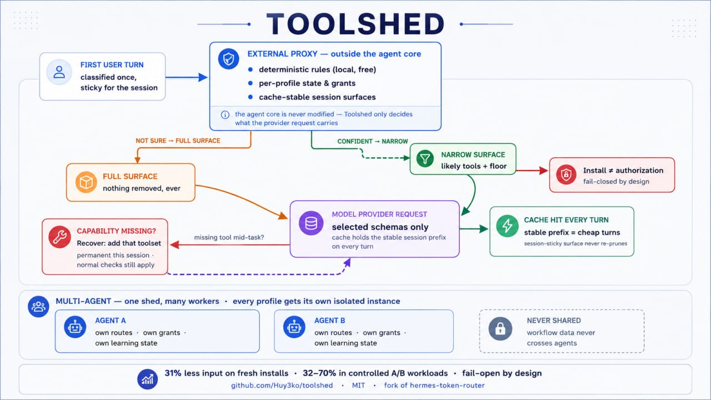

# Toolshed

<p align="center">
  <strong>Less tool overhead. Same agent capabilities.</strong>
</p>

<p align="center">
  An adaptive tool-surface proxy for Hermes that sends a smaller, relevant tool set to the model<br>
  while keeping missing capabilities reachable through Hermes' native recovery path.
</p>



## Measured results

| Test | Router OFF | Toolshed ON | Reduction |
| --- | ---: | ---: | ---: |
| Fresh GitHub canary run (single agent) | 15,263 input tokens | 8,696 input tokens | **43%** |
| Earlier controlled paired workloads | — | — | **24–70%** |

These are measured results, not a universal savings guarantee. Savings depend on the task, the
installed tool surface, routing confidence and the shape of the provider request. The validation
history — including experiments that were rejected — lives in [`adr/`](adr/).

## Why Toolshed?

Hermes agents accumulate dozens of tools, and every visible tool carries schema text into each
provider request — even when most of it is irrelevant to the current task.

Toolshed sits outside the agent core and reduces that surface before the request is sent:

- **Narrow when confident** — the likely working set plus protected floor tools go to the model.
- **Fail open when uncertain** — low confidence keeps the full surface instead of risking capability loss.
- **Recover when needed** — a missing toolset can be added during the session through `request_toolset`.
- **Keep agents isolated** — routes, grants, learning and telemetry stay profile-local.
- **No silent privileges** — Toolshed cannot touch the tool surface without Hermes' explicit `tools.override` grant.

## Quick start

**About profiles:** Hermes calls each agent configuration a *profile*. If you run one agent,
that's `default`. With several agents, repeat these steps for every profile.

```bash
# 1. Install from GitHub
hermes -p default plugins install Huy3ko/toolshed

# 2. Authorize the tool-surface override
hermes -p default plugins enable hermes-token-router --allow-tool-override
```

The grant lets Toolshed change **which already-authorized tools are visible to the model** — it does
not create new permissions. Installation uses Hermes' default security scan; do not disable scanning.
Installation and authorization are deliberately separate steps: no grant, no hook registration and
no routing. The manifest declares `tools.override`, so capability diagnostics show it as declared.

```bash
# 3. Turn routing on — in the installed plugin's config.yaml:
#    global: enabled: true
```

Then verify:

```bash
hermes -p default plugins capabilities hermes-token-router
# → tools.override: granted
```

When routing is active you'll see `deterministic route reason=…` and `narrowed to N toolsets`
in the Hermes logs.

## How it works

1. The first user turn is classified; the result stays sticky for the session.
2. Confident prediction → only likely tools + floor stay visible. Uncertainty → full surface.
3. A missing capability mid-task? Native Hermes recovery adds that toolset on demand.

That's the whole mechanism. Details are in the diagram above and in the ADRs.

## Multiple agents

One profile = one agent = isolated state:

```bash
hermes -p coding plugins install Huy3ko/toolshed
hermes -p coding plugins enable hermes-token-router --allow-tool-override
```

Routes, grants, learning and telemetry stayed profile-local in the validated setup. Because Hermes
may change profile semantics in future versions, re-verify isolation after upstream updates
(`hermes profile create --clone` did not copy plugins/grants/state in the validated test).

## Update

Use Hermes' supported updater directly, or the small wrapper shipped here:

```bash
hermes -p default plugins update hermes-token-router
./update.sh --profile default
./doctor.sh --profile default
```

Hermes fetches and scans the update before activation and surfaces capability-set changes for fresh
consent. Before updating, copy your installed plugin `config.yaml` to a safe location. An update may
replace plugin defaults, so afterwards verify the installed version, the `tools.override` grant and
your profile's `enabled`/floor/exclusion settings. If validation fails, restore that config backup
and reinstall the previous pinned commit as described below. The wrapper deliberately performs no
privileged writes and does not bypass the scanner.

## Pinned installs & rollback

`plugins install owner/repo` follows the default branch — it does not automatically mean "latest
release". For reproducible deployments, pin the commit behind a release:

```bash
hermes -p default plugins install https://github.com/Huy3ko/toolshed.git \
  --ref <release-commit-sha> --force
```

Rollback works the same way with the previous release's commit SHA. One Git detail matters here:
annotated tags have their own object SHA — Hermes expects the **commit SHA behind the tag**.

## Uninstall

```bash
hermes -p default plugins remove hermes-token-router
```

Hermes keeps working without Toolshed. The upstream uninstaller may leave the grant entry in your
config — it doesn't keep anything running, but remove it if you don't want it retained for a possible
reinstall.

## Tool-usage audit and tuning

Toolshed registers the native `/toolshed-audit` command on current Hermes versions:

```text
/toolshed-audit                         # deterministic report + model suggestions
/toolshed-audit --days 90 --report      # deterministic/offline mode
/toolshed-audit --days 30 --json --report
```

The report reads the active profile's Hermes `state.db` in read-only mode and queries only tool-call
names/timestamps. It combines those counts with live registry metadata and profile-local recovery
events to distinguish never-used, rarely-used, frequently-used, recovery-added, floor, eligible,
routed and excluded toolsets. It never selects prompt, response, reasoning or tool-output content.
The optional model receives only that deterministic metadata report and cannot apply changes.

No command silently removes capability. After reviewing the report and suggestions, an explicit edit
looks like:

```text
/toolshed-audit --report --apply-floor file,terminal,skills --apply-exclude image_gen --approve
```

Both an `--apply-*` option and `--approve` are required. The edit is profile-specific, preserves
floor-over-exclusion precedence, refuses to run if fail-open or automatic recovery safety is
disabled, validates the resulting YAML, creates a timestamped backup and displays a unified diff.
Excluded toolsets leave the initial candidate set but remain available through recovery and full
fail-open fallback. See [`docs/tool-usage-audit.md`](docs/tool-usage-audit.md).

## Security model

Toolshed changes which tools the model sees, so its contract is explicit:

- **Fail-closed on authorization:** no `tools.override` grant → no surface manipulation.
- **Fail-open on routing uncertainty:** uncertainty keeps capabilities rather than removing them.
- **Recovery stays native:** missing registered capabilities can be recovered during the session.
- **Floor policy is not content-controlled:** prompt or repository text cannot rewrite it.
- **Routing ≠ permission:** making a tool visible never creates permissions the agent didn't have.
- **Profile state stays isolated** across agents; local audit/recovery metadata lives under the active Hermes home.
- **Classifier privacy is explicit:** the optional classifier is disabled by default. If enabled, up to
  the first 1,500 characters of the user message are sent to its configured provider. Local usage
  metrics do not contain message content.

Adversarial testing covered manipulated repository content, read-only GitHub workflows, recovery,
stale capabilities and multi-profile isolation. See [SECURITY.md](SECURITY.md) for the full model
and how to report vulnerabilities.

## Known limitations

- Gateway-restart / learning persistence has not yet been fully validated under `systemd --user`.
- Less permanent tool visibility can reduce spontaneous exploration; required capabilities remained
  recoverable in all validated tests.
- `plugins install owner/repo` follows the default branch, not the latest release tag.
- An update can replace plugin-local defaults; keep a config backup and recheck activation — see Update.
- Plugin slash commands are supported by current Hermes. Older Hermes builds without
  `PluginContext.register_command` cannot expose `/toolshed-audit` and should be upgraded.
- Hermes APIs continue to evolve; rerun `plugins doctor`, capability diagnostics and a routed smoke
  call after upstream updates.

## Configuration

The shipped configuration is opt-in and conservative:

```yaml
global:
  enabled: false           # set true globally, or override under profiles.<name>
  floor_toolsets: [terminal, file, skills, memory, web]
  excluded_toolsets: []    # initial routing candidates only; recovery remains available
  fail_open: true
  auto_recover_registered_tools: true
  classifier:
    enabled: false         # enabling may send the first 1,500 message characters

shadow:
  enabled: false
```

There is no `mode` setting. Keep `floor_toolsets` small — every floor schema rides along in every
request. Per-profile overrides live under `profiles.<name>`. Audit edits always target that active
profile. Metrics and recovery-event logs are local to its Hermes home.

## For contributors

Architecture decisions, rejected mechanisms and validation history are documented, not hidden:
[`adr/`](adr/) · [`CHANGELOG.md`](CHANGELOG.md) · [`CONTRIBUTING.md`](CONTRIBUTING.md) ·
[`SECURITY.md`](SECURITY.md)

Project rule in one line:

> No mechanism gets added because it sounds good — only when a controlled test shows it's needed.

## Fork heritage & license

Toolshed is based on MIT-licensed `hermes-token-router` work by Jonathan Rivera (archived upstream)
and was substantially extended: dynamic MCP routing, compatibility work against current Hermes
upstream, lifecycle validation, security testing. See [`NOTICE`](NOTICE) and [`LICENSE`](LICENSE).

MIT.
